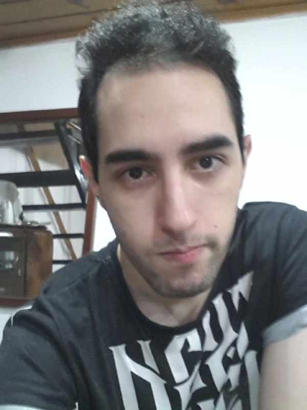

# Presentación
Hola. Me llamo Sebastián Forlizzi, nací en 1999 y esta es mi primera carrera. Soy técnico en programación, en secundaria me familiaricé con C y por mi cuenta jugué con cosas como javascript, css, php, y cosas así.
Soy alguien que prefiere mantener la calma o llegar tarde, antes que tener que hacer cosas apurado. Tal vez en parte por eso sea que me cuesta mucho levantarme de la cama o me quede dormido sin escuchar la alarma. Me gusta pensar, y opino que el hecho de trabarme en algún problema (sea de ingenio, de programación, o general) provoca que la solución a dicho problema tenga mucho más mérito.
No soy de ver series o películas, porque siento que consumen mucho tiempo. Sin embargo las películas que más me gustaron (de entre las pocas que vi) están:
- Inception
- El efecto mariposa
- Las posibles vidas de Mr Nobody

No tengo muchos pasatiempos, principalmente suelo estudiar la mayor parte del día cuando me atraso en las materias y me distraigo jugando videojuegos. A diferencia de las películas y series, jugué muchos juegos (la mayoría retro) pese a que consumen todavía más tiempo que las películas, ya que los disfruto mucho más. Entre los juegos a los que le tengo más estima están:
- Chrono Trigger
- Chrono Cross
- Final fantasy 7
- Xenogears
- The World ends with you (mi favorito)

Destacando sagas como Fire Emblem, Final Fantasy, Castlevania, Megaman (la saga clásica y la X), Phoenix Wright y Profesor Layton, entre otros. Así franquicias como pokemon o kirby. No soy de jugar juegos en línea, pero jugué bastante Elsword.

*Tampoco me gusta sacarme fotos.*
